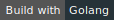

<h2 align="center">Webextensions for Tiddlywiki</h2>

	
	
	
</a>

   

- [Updates](#updates)
- [Intro](#intro)
- [Supported browsers](#supported-browsers)
- [Supported OS](#supported-os)
- [Installation](#installation)
- [Usage](#usage)
- [Pros](#pros)
- [Cons](#cons)
- [Credits](#credits)
	- [Logo credits](#logo-credits)

### Updates

* April 27, 2020: Timimi now supports chrome, chromium, opera in addition to firefox
* July 20, 2019: Thanks to the efforts by [@YakovL](https://github.com/YakovL), timimi has basic support for saving Tiddlywiki Classic too!

### Intro

Timimi is a browser extension that allows user to save standalone tiddlywiki - both TW5 and TW-Classic. In addition, Timimi also provides ability to backup the tiddlywiki files to a path of user's choice.

### Supported browsers

* Firefox >57
* Chrome > 30
* Chromium - Corresponding to Chrome
* Opera >33

### Supported OS

* Debian based systems - Debian, Ubuntu, Elementary, Mint etc
* Arch based systems - Arch Linux, Antergos, Manjaro etc
* Mac OSX
* Windows 7 and later.

PS: All OSes are 64bit systems. If anyone needs support for 32 bit systems, you will have to compile the host in the target system, Open an issue for assistance.

### Installation

Please see: https://ibnishak.github.io/Timimi/

### Usage

Please see: https://ibnishak.github.io/Timimi/

### Pros

* Standalone Tiddlywikis can be saved anywhere in the filesystem where you have permission to save files.
* User can install and forget. No need to run a server, does not require continued user interactions
* 4 different backup strategies

### Cons

Cannot be used in android

### Credits

#### Logo credits

Icons made by [Freepik](http://www.freepik.com) from <a href="https://www.flaticon.com/" title="Flaticon">www.flaticon.com</a> is licensed by <a href="http://creativecommons.org/licenses/by/3.0/" title="Creative Commons BY 3.0" target="_blank">CC 3.0 BY</a>

